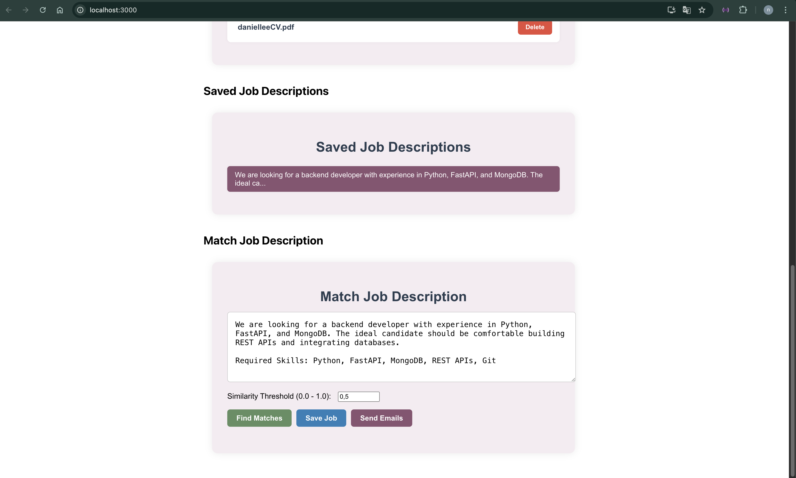

# TalentMatch NLP – AI-Powered CV Matching System

## Project Purpose
TalentMatch is an AI-based application that automatically matches job descriptions with candidate CVs.
Employers can submit a job description, and the system identifies the most relevant CVs based on semantic similarity.
It highlights missing skills and optionally sends emails to matched candidates.

## Steps Completed & Features
### CV Upload System
Supports uploading up to 10 .pdf or .docx CVs.
Explicit consent checkbox (GDPR compliance) is required before uploading.
All CVs are stored in MongoDB with metadata.

### Text Extraction & Preprocessing
Text is extracted using pdfplumber and python-docx.
Extracted fields: name, email, phone.
CVs are segmented into logical sections.
Sections are labeled using zero-shot classification (facebook/bart-large-mnli).

### Embedding Generation
Each CV and job description is embedded using all-MiniLM-L6-v2 (SBERT).
Embeddings are stored in MongoDB.
Cosine similarity is used to measure match strength.

### FAISS-Based Matching
FAISS is used to index CV embeddings and perform fast similarity search.
A configurable threshold filters low-relevance matches.
Missing skills are identified by comparing job vs. CV keywords.

### Automated Summarization
CVs are summarized using t5-small model.
Summary is shown along with extracted info.

### Email Notifications
Matching candidates can be notified via email.
SMTP credentials are stored securely in a .env file.

### Frontend Interface
Built with React.
Includes components for CV upload, job creation, match results, and CV/job listing.
Uses axios and fetch to communicate with FastAPI backend.
Styled with plain CSS (no UI framework).

## Technologies Used

**Backend:**
- Python
- FastAPI
- spaCy
- HuggingFace Transformers
- Sentence-Transformers
- FAISS
- MongoDB

**Frontend:**
- React
- Axios
- CSS

**NLP Models:**
- `facebook/bart-large-mnli` – section classification
- `all-MiniLM-L6-v2` – semantic embeddings
- `t5-small` – summarization


## Backend File Structure

- `app.py`: Initializes FastAPI app, MongoDB connection, and loads FAISS index
- `api.py`: All REST API endpoints (upload, match, email, etc.)
- `parser.py`: Text + field extraction
- `sectioner.py`: Section detection and labeling
- `embedding_utils.py`: Embedding + similarity
- `faiss_utils.py`: FAISS index creation + search
- `summarizer.py`: Shortens CVs
- `email_utils.py`: Sends email to matched candidates
- `requirements.txt`: Python dependencies

## .env Configuration

Create a `.env` file inside the `backend/` directory with the following content:

```env
MAIL_USER=your_email@example.com
MAIL_PASS=your_app_password
```

## How to Run

#### Backend

  ```bash
cd backend
python -m venv venv
source venv/bin/activate  # Windows: venv\\Scripts\\activate
pip install -r requirements.txt
python -m spacy download en_core_web_sm
uvicorn api:app --reload

```
#### Frontend

  ```bash
cd frontend
npm install
npm start
```

## GDPR Compliance
CVs are only processed with explicit consent.
Emails are sent manually via admin confirmation.
No automatic tracking or external data storage is used.

## API Endpoints
```http
POST    /upload-cv/
GET     /uploaded-cvs/
GET     /cv-details/
POST    /match-job/
POST    /send-emails/
POST    /submit-job/
GET     /saved-jobs/
DELETE  /delete-cv/
```

## UI Screenshots

### Upload CV Page


### Uploaded CV List


### Saved Job Descriptions & Matching


### Match Results & Emails Sent


